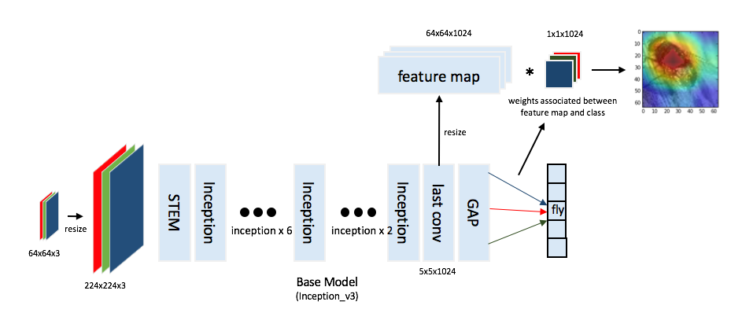
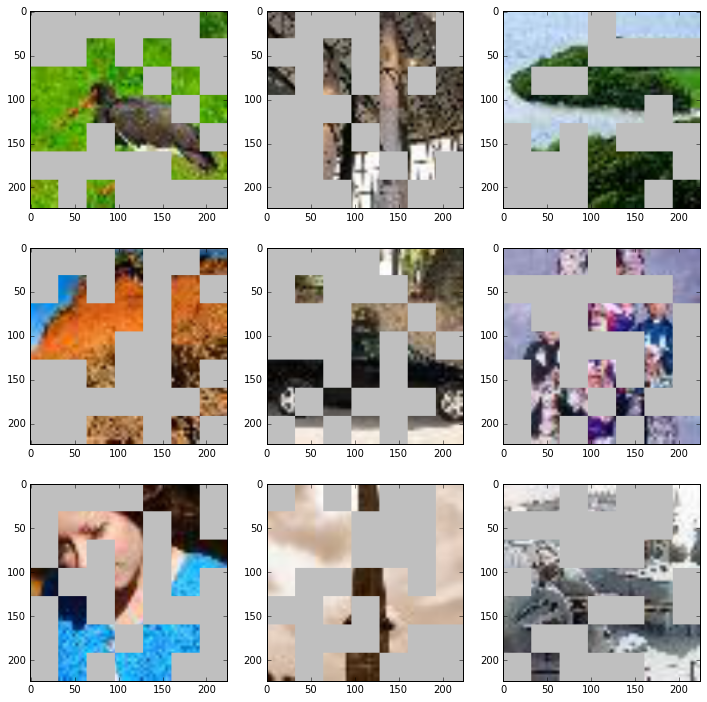
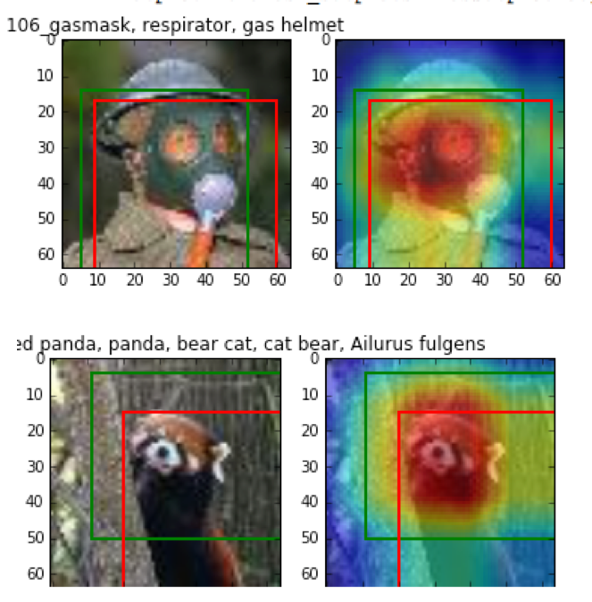
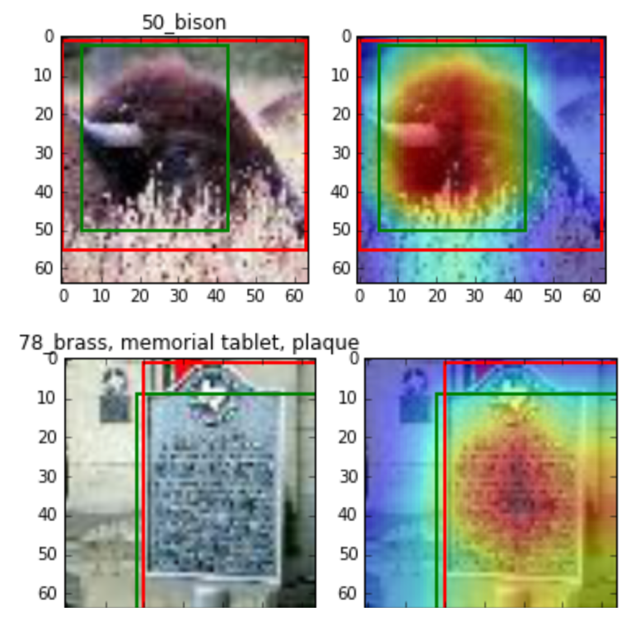

# Hide and Seek - Weakly Supervised Object Detector
Implementation of "Hide-and-Seek: Forcing a Network to be Meticulous for Weakly-supervised Object and Action Localization"
[https://arxiv.org/abs/1704.04232][paper_link]

[paper_link]: https://arxiv.org/abs/1704.04232

- - -

## Download data 

Download data with the script below.
The script download tiny-imagenet data and transform to pickle and tfrecord.
The pickle include datasets and meta information of label dictionary.
The tfrecord contains datasets; train dataset, valid dataset, test dataset.

```
python3 download_data.py
```

## Requirements

+ python3.4+
+ pip3
+ python packages - requirements.txt
+ tensorflow 1.4+


## How to train

```
$ jupyter lab

and open train_HaS.ipynb

or 

use snippet_train_model.py
```

##  How to test

```
$ jupyter lab

and open load_and_test.ipynb
```

## Architecture



## Hide Patches Example



## Result Sample

+ Green bounding box is prediction 
+ Red bounding box is ground truth





